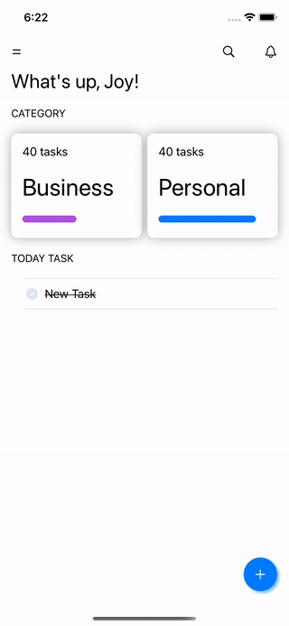
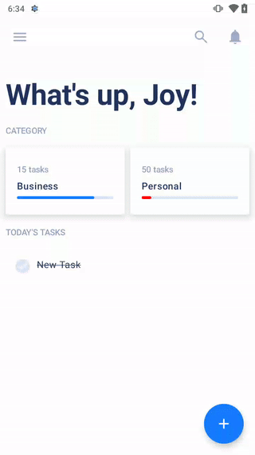

<h1 align="center"> Todo Task </h1>

* Using KMM SwiftUI and Jetpack compose shared Data layer

<table>
  <tr>
    <td>  <td>
    <td>  <td>
  </tr>
</table>

## Thank cool ui design
[https://dribbble.com/shots/14100356-ToDo-App-UI](https://dribbble.com/shots/14100356-ToDo-App-UI)